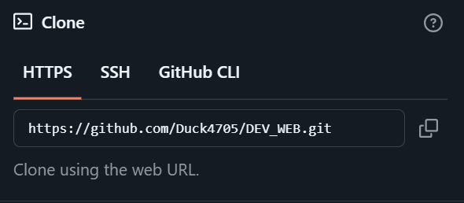
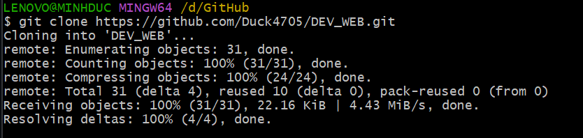
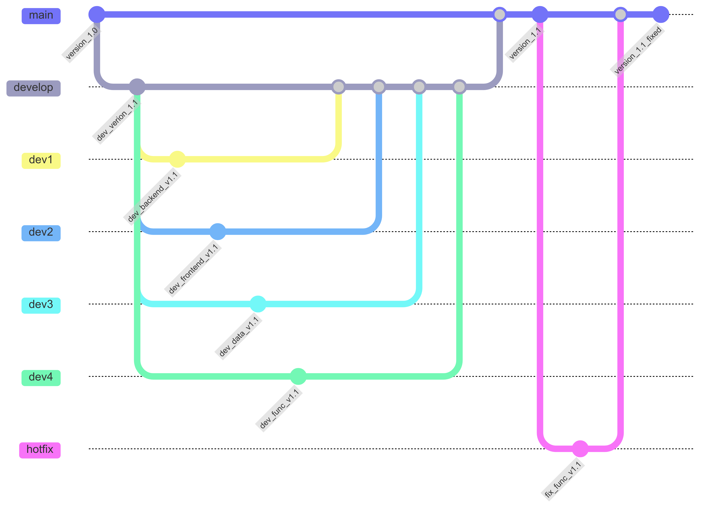

# Lập trình ứng dụng Web - NT208.P24

## Mục lục 
1. [Giới thiệu repo](#giới-thiệu-repo)
2. [Hướng dẫn sử dụng git và github](#hướng-dẫn-sử-dụng-git-và-github)
3. [Gitflow](#gitflow)
4. [Nội dung đồ án](#nội-dung-đồ-án)
5. [Tổng kết](#tổng-kết)

## Giới thiệu repo
## Hướng dẫn sử dụng git và github
1) Hướng dẫn clone dự án về máy  
Khi clone dự án về máy lập trình viên cần copy link sau.  
  
Sau khi copy chúng ta cần sử dụng lệnh sau để clone và sau khi clone thành công sẽ hiển thị như hình ảnh sau  
  
2) Hướng dẫn về branch trong git  
Để kiểm tra nhánh hiện tại dùng lệnh sau  `git branch`  
Dấu * chỉ nhánh đang ở hiện tại  
Để tạo nhánh dùng lệnh `git branch [Tên nhánh muốn tạo]`  
Để chuyển nhánh dùng lệnh `git checkout [Tên nhánh muốn nhảy đến]`  
3) Hướng dẫn về đẩy code lên github  
Sau khi lập trình viên hoàn thành và muốn đẩy một file nào đó lên github thì cần thực hiện các bước sau:  
###### Bước 1: Dùng lệnh `git add [tên file hoặc thư mục cần đẩy]` hoặc `git add .`(lệnh này sẽ đẩy tất cả các file và thư mục lên)  
###### Bước 2: Dùng lệnh `git commit -m "Nội dung"`  
###### Lưu ý: phải có dấu "" và phần nội dung nằm trong "".
###### - Nội dung phải có định dạng:
    - "[Mục đích đẩy] [loại] [tên] [ngày đẩy] *[lần cập nhật]"
    - [Mục đích đẩy] bao gồm {tạo, cập nhật, xóa}
    - [loại] bao gồm {file, folder}
    - [tên] là tên file hoặc thư mục
    - [ngày đẩy] là ngày đẩy file hoặc thư mục lên
    - *[lần cập nhật] là lần cập nhật khi mục đích đẩy thuộc loại cập nhật, nếu không phải cập nhật thì không cần dòng này.

###### Ví dụ: `git commit -m "tạo file test.html 20/2/2025"` hoặc `git commit -m "cập nhật file test.html 20/2/2025 lần 1"`  
###### Bước 3: Dùng lệnh `git push origin [tên nhánh]`  
###### Lưu ý: chỉ được đẩy nhánh thay đổi và nhánh làm việc của mình. Lập trình viên không tự ý đẩy lên nhánh main  
4) Hướng dẫn việc pull về máy  
Sử dụng lệnh `git pull` dể pull repo trên github về repo máy mình.  
Lưu ý: Ở repo nào thì pull repo ấy. Không được xài lệnh `git pull origin` khi chưa biết cách sử dụng. Ví dụ nếu đang ở main mà dùng `git pull origin dev` nó sẽ tự động pull và merge dev vào nhánh main rất nguy hiểm  

## Gitflow

Các bạn lập trình viên lưu ý hình ảnh trên là ví dụ gitflow chúng ta phải tuân thủ và làm việc trên nhanh của mình  
Ví dụ: Thành viên 1 phát triển tính năng 1 sẽ làm việc trên nhánh dev1 khi nào hoàn thành chức năng thì có thể merge vào nhánh develop. Và thành viên 1 này chỉ được phép làm việc trên nhánh dev1 không tự tiện sang nhánh dev2 làm việc  
  
Sau đâu là chi tiết mục đích của các nhánh:  
- Nhánh `main`: Là nhánh phiên bản web chính thức đang được phát hành và sẽ merge nhánh `develop` khi các chức năng đã được phát triển xong
- Nhánh `develop`: Là nhánh phát triển tính năng của web, sau khi phát triển hoàn tất sẽ tiến hành kiểm thử các chức năng xem có lỗi hay không rồi mới được phép merge vào nhánh `main`
- Nhánh `dev_`: Là nhánh con của nhánh `develop`, ở nhánh này sẽ phát triển từng chức năng riêng lẻ của web và sẽ được quản lý bởi từng cá nhân lập trình viên, sau khi kiểm thử các tính năng nhánh sẽ được merge vào `develop`:
  - Nhánh `dev_` sẽ được chia thành bốn nhánh và được quản lý bởi các thành viên sau:
    - `dev1` sẽ được quản lý bởi `Mai Nguyễn Phúc Minh`
    - `dev2` sẽ được quản lý bởi `Phạm Huy Hoàng`
    - `dev3` sẽ được quản lý bởi `Lê Đình Hiếu`
    - `dev4` sẽ được quản lý bởi `Tào Minh Đức`
- Nhánh `hotfix`: Là nhánh khắc phục lỗi nhanh khi bản phát hành chính thức đang bị lỗi, sau khi khắc phục lỗi thì sẽ được merge lại vào nhánh `main`
    
## Nội dung đồ án
## 🎬 Website Đặt Vé Xem Phim Trực Tuyến

## 📌 Giới thiệu

Đây là đồ án môn *Lập trình Web Ứng dụng* với mục tiêu xây dựng một **website đặt vé xem phim trực tuyến**, cho phép người dùng tra cứu thông tin phim và đặt vé một cách trực quan, nhanh chóng.

---

## 🚀 Chức năng chính

### 🎥 Hiển thị phim đang chiếu
- Giao diện trang chủ hiển thị danh sách các bộ phim đang được chiếu tại rạp.
- Thông tin phim gồm: tên phim, mô tả ngắn, thời lượng, poster, lịch chiếu.

### 💺 Đặt vé trực quan bằng sơ đồ ghế
- Người dùng chọn suất chiếu và thực hiện đặt vé bằng **cách chọn ghế trực tiếp trên màn hình**.
- Giao diện sơ đồ ghế thể hiện rõ ghế trống và ghế đã được đặt.
- Tình trạng ghế được cập nhật **theo thời gian thực**, giúp tránh trùng lặp đặt chỗ.

### 📝 Lưu thông tin đặt vé
- Sau khi đặt vé, hệ thống lưu lại các thông tin:
  - Tên người đặt
  - Suất chiếu đã chọn
  - Vị trí ghế
- Hỗ trợ xác nhận đặt vé và tra cứu lại khi cần thiết.

### 🔐 Trang quản trị cho Admin
- Quản trị viên có thể đăng nhập vào hệ thống quản lý và thực hiện:
  - ✅ Thêm phim mới
  - 📝 Chỉnh sửa thông tin phim
  - ❌ Xóa phim không còn chiếu
  - 📅 Quản lý suất chiếu và các thông tin liên quan

---

## 🛠️ Công nghệ sử dụng

- **Frontend:** HTML, CSS, JavaScript
- **Backend:** Node.js, Express.js
- **Cơ sở dữ liệu:** MySQL
- **Thư viện & Công cụ hỗ trợ:** Socket(Dùng cho chức năng chọn ghế).

---

## 🖼️ Một số hình ảnh tham khảo của website

---

## Tổng kết
